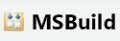

# MSBuild Tasks Library

## Overview

 Allows you to call dynaTrace automation tasks from MSBuild

| Name | MSBuild Tasks Library
| :--- | :---
| Author | dynaTrace software
| Supported dynaTrace Version | >= 5.5
| License | [dynaTrace BSD](dynaTraceBSD.txt)
| Support | [Supported](https://community.compuwareapm.com/community/display/DL/Support+Levels#SupportLevels-Supported)
| Release history | Version 1.0
| Download | [MSBuild Tasks for dynaTrace 6.1](dynatrace-msbuild.plugin-6.1.0.7880.zip)
| | [MSBuild Tasks for dynaTrace 6.0](dynatrace-msbuild.plugin-6.0.0.6733.zip)
| | [MSBuild Tasks for dynaTrace 5.6](dynatrace-msbuild.plugin-5.6.0.5713.zip)
| | [MSBuild Tasks for dynaTrace 5.5](dynatrace-msbuild.plugin-5.5.0.5226.zip)

## Description

The Download Package includes an .NET Library that implements several tasks to be used by MSBuild scripts.

Following tasks can be executed:

  * Start, Stop or Restart the dynaTrace Server 

  * Start and Stop Session Recording 

  * Change Active Configuration 

  * Set Test Information (new in dT 3.5) 

This library makes use of the [.NET Command Library](https://community.compuwareapm.com/community/display/DL/.NET+Command+Library).

## Installation

  1. Save the attached file locally to the computer where the dynaTrace Diagnostics Client is installed. 

  2. Unzip the file. 

  3. Copy the two extracted dlls to a directory where it can be picked up by MSBuild when executing your build scripts 

  4. View the extracted msbuild_sample.xml file. It shows how you can register the new build tasks in your MSBuild scripts 

## Usage

You have to register the new Build Tasks with the UseTask configuration entry in your build scripts like this:

    
    
    <UsingTask AssemblyFile="dynaTrace.MSBuild.Task.dll" TaskName="dynaTrace.MSBuild.Task.StartSessionRecordingTask" />
    <UsingTask AssemblyFile="dynaTrace.MSBuild.Task.dll" TaskName="dynaTrace.MSBuild.Task.StopSessionRecordingTask" />
    <UsingTask AssemblyFile="dynaTrace.MSBuild.Task.dll" TaskName="dynaTrace.MSBuild.Task.SetActiveConfigurationTask" />
    <UsingTask AssemblyFile="dynaTrace.MSBuild.Task.dll" TaskName="dynaTrace.MSBuild.Task.ServerServiceTask" />
    <UsingTask AssemblyFile="dynaTrace.MSBuild.Task.dll" TaskName="dynaTrace.MSBuild.Task.ConfigureApplicationTask" />
    <UsingTask AssemblyFile="dynaTrace.MSBuild.Task.dll" TaskName="dynaTrace.MSBuild.Task.SetTestInformation" />

Each task can now be used in your targets. Following properties are available for the different tasks:

** _StartSessionRecordingTask_ **

  * ProfileName: (mandatoy) - specifies the System Profile you want to start recording on 

  * RecordSessionName: (optional) - allows you to define the name of the recorded session 

  * dtVersion: (optional) - this is the dynaTrace Client Version that you want to use. In case multiple versions of dynaTrace are installed you use this to connect to the correct version 

  * dtInstallDir: (optional) - this is the dynaTrace Client Installation directory. If not specified the value is read from the registry 

  * ServerName: (optional) - the dynaTrace Server Hostname to connect to. Default: localhost 

  * Username: (optional) - the username to connect to the dynaTrace Server. Default: admin 

  * Password (optional) - the password to connect to the dynaTrace Server. Default: admin 

** _StopSessionRecordingTask_ **

  * ProfileName: (mandatory) 

  * dtVersion, dtInstallDir, ServerName, Username, Password: see description of StartSessionRecording 

** _SetActiveConfigurationTask_ **

  * ConfigurationName: (mandatory) - configuration name to switch to 

  * ProfileName: (mandatory) - System Profile where you want to switch the active configuration 

  * dtVersion, dtInstallDir, ServerName, Username, Password: see description of StartSessionRecording 

** _ServerServiceTask_ **

  * ServiceCommand: (mandatory). Allows one of the following values: startup, restart, shutdown 

  * dtVersion, dtInstallDir, ServerName, Username, Password: see description of StartSessionRecording 

** _ConfigureApplicationTask_ **

  * Executable: (mandatory). Defines the full path to the executable you want to configure, e.g.: C:\MySample\MyApp.exe 

  * Active: (mandatory). True or False. Allows to switch a configuration active or inactive 

  * AgentName: (optional). Name of the Agent. Default: name of the executable file, e.g.: MyApp.exe 

  * CommandLine: (optional). Command Line that must match the process. Default: empty==any command line value 

  * ServerName: (optional). dynaTrace Servername to let the Agent connect to. Default: localhost 

  * ServerPort: (optional). dynaTrace server port to let the Agent connect to. Default: 9998 

  * LogFile: (optional). location where to store Agent logfile 

  * LogLevelLife: (optional). LogLevel for the Log File. Possible Values: LOG_NONE, LOG_SEVERE, LOG_WARNING, LOG_INFO, LOG_FINE, LOG_FINER, LOG_FINEST. Default: LOG_NONE 

  * LogLevelConsole: (optional). LogLevel for Console Loggin. Default: LOG_INFO 

** _SetTestInformation_ ** (new in dynaTrace 3.5) 

  * VersionMajor: Major Version of your Software 

  * VersionMinor: Minor Version of your Software 

  * VersionRevision: Revision of your Software 

  * VersionBuild: Build Number of your Software 

  * VersionMilestone: Milestone of your Software 

  * Marker: Marker Name that should be shown in the chart for this test execution 

  * Agent Group: The name of the agent group that this test information should be set for. Applied to all agent groups if not set. 

  * SystemProfile: The name of the system profile that this test information should be set for. 

  * CustomProperty: A custom property that should be set for this test information 

## Internals

The Library uses the dynaTrace.Command.dll which is installed with the dynaTrace Client. dynaTrace.Command.dll uses the dynaTrace Web Service interfaces. For every dynaTrace.Command.dll call the
library creates an EventLog Entry with detailed information about the command line arguments that were passed. This should help with troubleshooting.

The task ConfigureApplicationTask needs write access to the HKLM Registry on your local machine. In case your user does not have the appropriate access rights you will run into errors.

## Sample MSBuild Script

The download package includes a sample msbuild file. Check it out for a reference

An additional sample can be seen here: [VSTS Sample Test Project](https://community.compuwareapm.com/community/pages/createpage.action?spaceKey=DL&title=VSTS+Sample+Test+Project&linkCreation=true&fromPageId=8651508)

